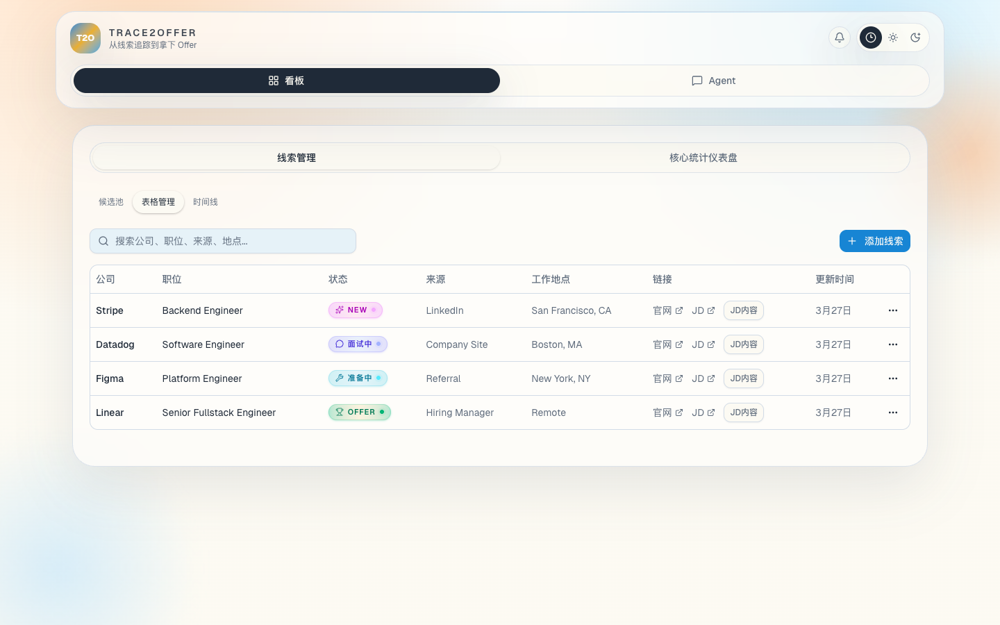
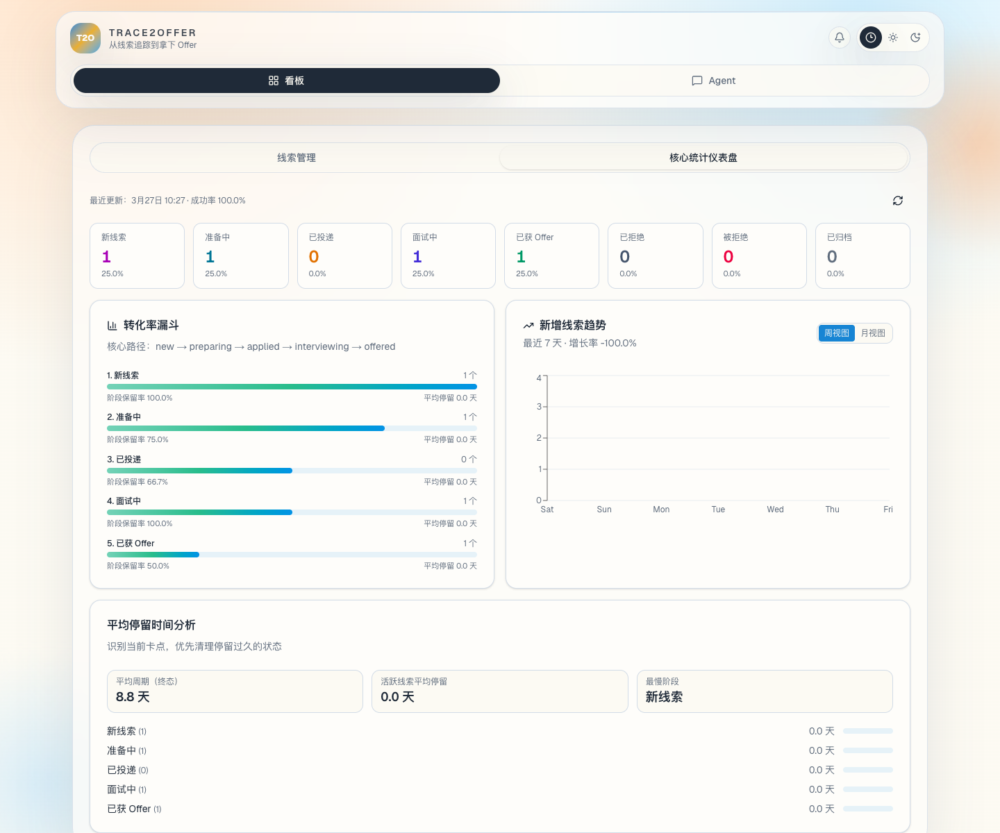
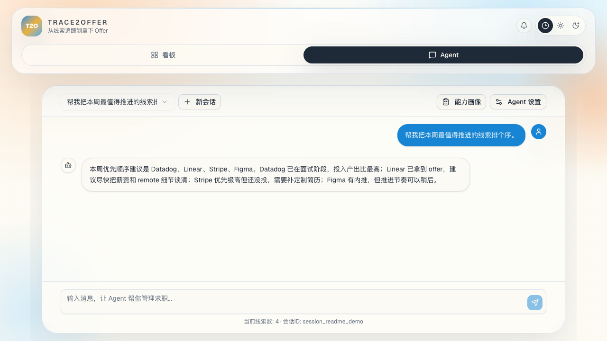

# Trace2Offer

Trace2Offer 是一个面向求职场景的工作台：用极简看板统一维护职位/公司线索，再配一个专门服务求职流程的 Agent，帮你盯进度、看数据、做筛选、补策略。

核心思路：别让求职信息散落在聊天记录、浏览器收藏夹和一堆待办里，统一收口在工作台内。

## 演示截图

### 看板页



### 核心统计仪表盘



### Agent 对话页



## 现在能干什么

- 管理求职线索：`lead` 支持增删改查、状态流转、优先级、下一步动作、提醒方式、JD 链接和备注。
- 管理候选池：发现到的岗位先落到 `candidate`，确认值得推进后再转成正式 `lead`。
- 看统计盘：总量、漏斗、趋势、阶段停留时长都能直接看。
- 跑发现规则：支持通过 RSS/Atom 抓岗位，先筛进候选池，再人工决策。
- 跟 Agent 聊：围绕当前线索、用户画像和历史会话给建议，支持会话、记忆、用户偏好和工具调用。
- 导出日程：提供 interview 日历导出接口，支持 `ICS` / `CalDAV` 读取。
- 本地落盘：不依赖数据库，所有数据都保存在本地文件。

## 架构概览

### Web

- 基于 `Next.js 16`、`React 19`、`TypeScript`、`Tailwind CSS v4`
- 主要页面只有两个：
  - `看板`：候选池、表格管理、时间线、统计仪表盘
  - `Agent`：会话、设置、用户画像、简历导入

### Backend

- 基于 `Go 1.25` + `Gin`
- 提供 REST API，负责：
  - `leads / candidates / discovery rules / timelines`
  - `stats / reminders / calendar`
  - `agent chat / sessions / settings / user profile`

### Agent Runtime

- 一个超轻量、可扩展的 Go Agent runtime
- 已内置的核心模块：
  - `session`
  - `memory`
  - `tool registry`
  - `OpenAI Responses provider`
  - `AGENTS.md / HEARTBEAT.md / IDENTITY.md / USER.md`

## 数据存储

项目默认把运行数据放在 [`backend/data`](./backend/data) 下，典型文件包括：

- `leads.json`
- `candidates.json`
- `discovery_rules.json`
- `lead_timelines.json`
- `sessions/*.json`
- `agent_memory.json`
- `user_profile.json`

暂时基于本地单机事实源，不引入数据库。想迁移、备份、做 demo 数据都很直接。

## 目录结构

```text
.
├── backend/                # Go 服务、Agent runtime、本地存储
│   ├── agent/              # session / memory / tools / provider / prompts
│   ├── cmd/server/         # 后端入口
│   └── internal/           # API、业务服务、文件存储
├── web/                    # Next.js 前端
├── docs/                   # 设计文档、说明、README 截图
└── Makefile                # 一键启动前后端
```

## 快速开始

### 1. 准备环境

- `Go 1.25+`
- `Node.js 22+`
- `pnpm 10+`

### 2. 安装依赖

```bash
cd web
pnpm install
```

Go 依赖会在首次运行时自动拉取；也可手动拉取：

```bash
cd backend
go mod download
```

### 3. 配置环境变量

```bash
cp backend/.env.example backend/.env
```

至少要补上：

```bash
OPENAI_API_KEY=your_openai_api_key
```

说明：

- 后端启动时会校验 `OPENAI_API_KEY`，必填。
- 默认数据目录是 `backend/data`。
- 默认后端端口是 `8080`，前端默认跑在 `3000`。

### 4. 启动项目

在仓库根目录执行：

```bash
make dev
```

这个命令会同时启动：

- Go 后端：`http://127.0.0.1:8080`
- Next.js 前端：`http://127.0.0.1:3000`

打开前端后：

1. 在 `看板` 页面维护线索、候选池和统计盘
2. 在 `Agent` 页面配置模型、补用户画像、发起对话

## 常用命令

### 根目录

```bash
make dev
```

### 后端

```bash
cd backend
make run
make test
make smoke
```

### 前端

```bash
cd web
pnpm dev
pnpm build
```


## 相关文档

- 发现规则快速上手：[docs/discovery-rules-quickstart.md](./docs/discovery-rules-quickstart.md)
- Discovery onboarding 设计稿：[docs/superpowers/specs/2026-03-23-discovery-onboarding-design.md](./docs/superpowers/specs/2026-03-23-discovery-onboarding-design.md)
- Discovery onboarding 计划：[docs/superpowers/plans/2026-03-23-discovery-onboarding.md](./docs/superpowers/plans/2026-03-23-discovery-onboarding.md)

## 局限

- 目前是本地优先、单用户形态，不是多租户 SaaS。
- 模型 provider 目前只接了 `OpenAI Responses`。
- 数据靠本地文件持久化，适合个人使用、原型验证和快速迭代。

